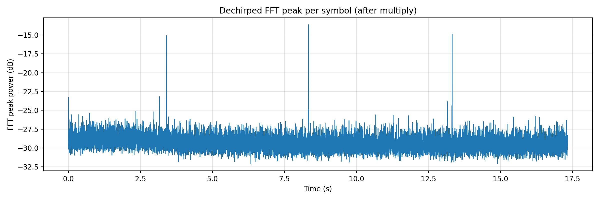
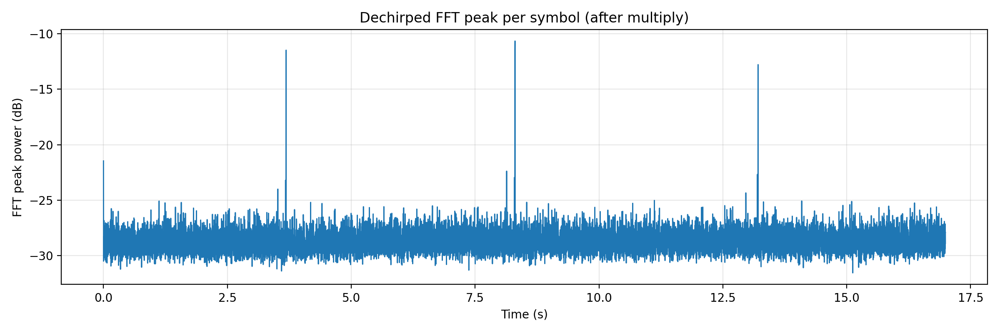
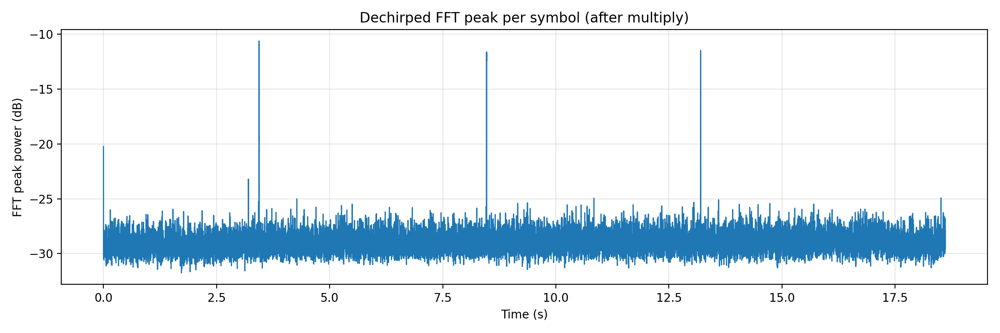
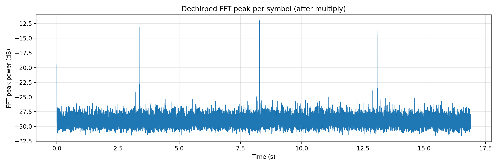
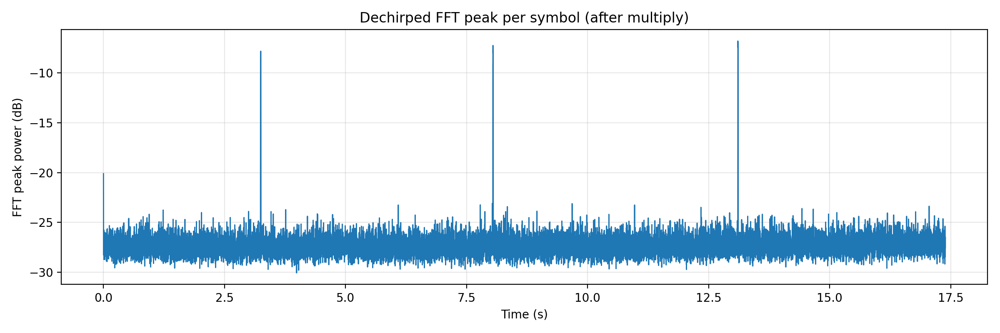
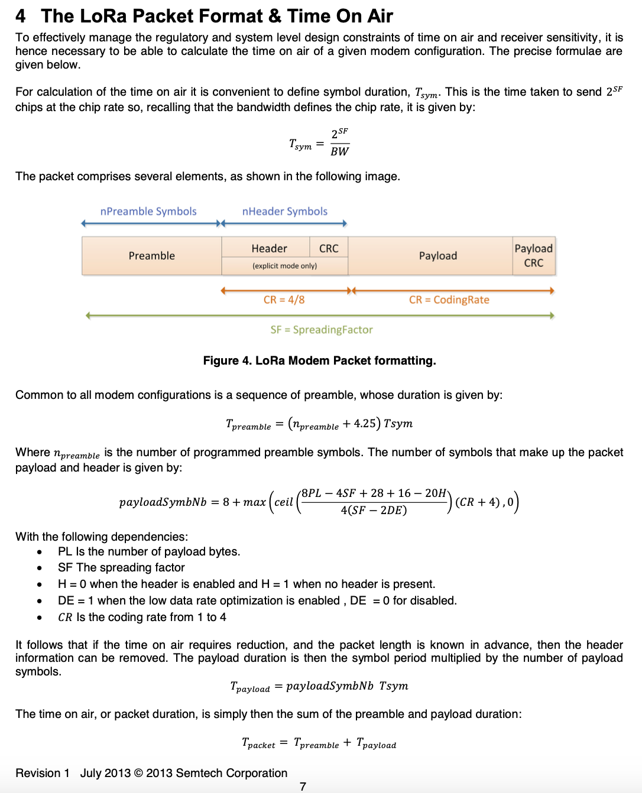

# 笔记步骤
开始前 ：
git pull
开始后：
git add .
git commit -m "daily: 2026-02-06"
git push
插图，你可以直接把图片放到images里，然后按照以下步骤，但是也要注意先pull
git add images/plot.png
git commit -m "add plot image"
git push

# Comptage

## 思路

首先，我们使用 produce_upchirp.py 脚本生成仅包含 LoRa 上升 chirp 的基带二进制文件，文件中分别包含 1、2、4、6 和 8 个 upchirp，用于研究不同前导码长度对 chirp 检测性能的影响。

随后，在发送端引入随机性，通过 tx_random.py 脚本在 10 秒的观测时间窗口内随机发送这些 chirp 信号，以模拟节点之间异步、随机接入的通信场景。

在接收端，本地生成一个与发送端参数一致的 LoRa 上升 chirp 作为参考信号。通过将接收信号与该参考 chirp 的共轭相乘，实现 dechirp 操作。
若接收信号中存在 LoRa chirp，该操作会将其线性扫频特性转化为近似恒定频率分量，从而在频域中产生明显的单频(以一个固定的速度转动)峰值。

FFT 用来判断信号中是否存在稳定的频率分量。在本实验中，通过 dechirp 操作将 LoRa chirp 转化为近似单频信号，使得 FFT 能够以峰值形式检测 chirp 的存在。

随后对 dechirp 后的信号进行 FFT 频域分析，通过观察频谱中的波峰特征来判断 chirp 是否被成功接收。当接收到 chirp 信号时，其对应的频谱中会出现明显高于噪声底的波峰，从而实现对 chirp 存在性的检测。

## 思路 english

## 实验仿真
1.剥皮法，现在的alg123都是使用这个方法。
alg1： 代表的是1111111111 完全相同
alg2:1000000001，完全相同
alg3:1........1,百分之25的1，可能出现序列不同的，也会出现相同的

**Lorawan仿真**
2.
在 LoRaWAN uplink 中，使用 explicit header mode（IH=0），并根据 SF 与 BW 判断是否启用 low data rate optimization（DE）。PHY payload symbol 数由 LoRa airtime 公式计算，该结果已包含 PHY header、header CRC 以及 payload CRC。因此，总符号数等于前导码符号数（12.25）加上计算得到的 payload symbols

LoRaWAN 的节点是在某个时间点开始发一整帧（trame）”。因为lora帧是连续的，所以，
如果两帧在时间上重叠，就发生碰撞，这两帧都算失败；
如果一帧在它的整个发送时间内没有别人发，就算成功 +1。
完全仿真lora的话12.25 + 33 = 45.25symbol,45.25
premble 12.25chirp

MHDR    = 1B
FHDR(7B) = DevAddr 4B + FCtrl 1B + FCnt 2B + FOpts 0B（最小情况）
MIC     = 4B
FRMPayload = 1B 数据内容
Fport   = 1B 因为我们有数据
一共是1+1+1+7+4=14B
根据公式

我们选择的sf=7，bw125khz
CR = 1 = 4/5，是 LoRaWAN 默认最省 airtime 的纠错率
PL=14
DE  = 1 if SF >= 11 else 0
H = 0

我们将每一次 LoRaWAN 帧发送建模为一个连续的时间区间 [ti,ti+Tframe]
首先对所有帧的开始时间进行排序，然后沿时间轴从最早开始的帧向右扫描。以当前帧为起点，维护一个变量表示当前碰撞簇的结束时间，并不断将所有开始时间早于该结束时间的后续帧并入同一簇，同时更新簇的结束时间为其中最晚的帧结束时刻。当下一个帧的开始时间不再早于该结束时间时，当前簇结束。若该簇仅包含一帧，则该帧被判定为成功；若簇内包含多于一帧，则认为发生碰撞，簇内所有帧均失败。

**实验代码的一些思路**

**实验1：one chirp**
分为六步写的，第一是写么随即生成N个noeud,只在N个点分别选择了不同的时间发送，这个区间大概是在0-100000ms-1.024ms期间，因为一次chirp的发送设定的是1.024ms.

第二步是排序，因为生成了那个点，所以需要排序，比如有的大有的小，这样就需要用到**np.sort**.
第三步是加入一个碰撞时间，这里是两种方式，第一是在0-1.024这一个chirp里如果检测到其他的chirp,其他chirp的起始点在这个内，不管多少个全部认为碰撞只保留1个，第二种是一个都不保留。

第四步就是加入一个**trial**，这个的意思就是一次完整的随机试验，我前面做的一整套就是一次随即试验，但是每一次都有可能不一样，我们最好做很多次trial.
第五步就是把固定的n变成一个list。

mean 看数量，std 看波动，ratio 看成功概率。

**实验2 one sequence （不考虑，看后续）**

***唯一序列上限是 2^(L-2不同的序列)*** 目前先不用这个不同的序列

首先，**第一步**我先生成了首尾是 1 的，N 个独一无二的序列，这里用到了**seed**,seed 是随机种子
相同的 **seed** → 每次生成的序列都一样
不同的 **seed** → 序列会不一样.
还用到了**p=0.5**，通过判断大于p来产生1和0.
在每次生成一条新的随机序列后，将其转换为一个不可变的元组 key，用于在集合 seen 中进行快速查重，从而保证每个节点被分配到的序列是唯一的。**set**就是 用来快速存放并检查这些指纹，从而保证每个序列都是唯一的。****tuple**把序列变成“不可变的指纹”.
随机性（seed） 用于构造大量不同但可复现的实验实例；
set + tuple 是核心工具，用于保证模板唯一性和检测去重；

**第二步**，将总时间分为不同的槽，比如总时间是 10 s，一个 chirp 是 1 ms，那么按 1 ms 分”。把连续时间，换算成离散的 chirp 槽个数。这里用到了**np.floor**,不管小数是多少，直接砍掉小数部分，往小的整数走,这样保证了槽的可用性。知道了总时间可以分为多少槽
**第三步**，就是给N各节点都选择一个起始槽，同时要满足最后一个点是小于M-L+1,因为用到了**np.random.randint(0, M - L + 1)**，这个意思就是产生一个整数，大于等于0小于M-L+1,覆盖所有的情况。，创建随即发送可以使用的槽，注意是起始槽，就是规定了每个节点发送的起始槽的位置
**第四步**，就是设置为每个节点打算在哪些位置发送变成在整个时间轴的哪几个槽发送，我们可以知道时间轴上的 1 在哪里。
**第五步**，就是在接受端上，现在把所有的节点里发得1都放到接收端里
**第六步**， 首先用到了**shape** 告诉你 seq 有多少行和多少列，也就是 N（节点数）和 L（序列长度）。先将每个节点的模板序列用 tuple() 转换为键，建立模板到节点编号的字典。随后在接收序列 y 上用长度为 L 的滑动窗口逐点扫描，将窗口内容同样转为 tuple() 并查字典。若窗口与某模板完全一致，则判定对应节点被检测到，并用 set() 去重，同一节点只计一次。最终统计被检测到的不同节点数量。

