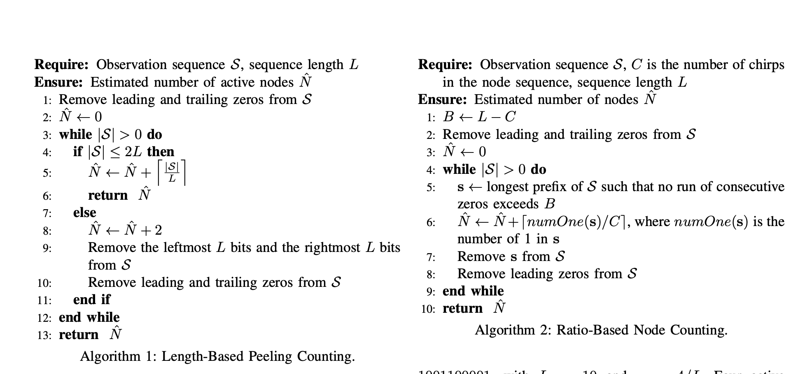

# Counting lora
1. 实验实现

1.1 发射信号生成

首先，我们使用 produce_upchirp.py 脚本生成仅包含 LoRa 上升 chirp 的基带二进制文件。生成的文件中分别包含 1、2、4、6 和 8 个连续的 upchirp，用于研究不同前导码长度对 chirp 检测性能的影响。

1.2 发射端设置

随后，在发送端引入随机性。通过 tx_random.py 脚本，每隔 5 s 发送一个 chirp 信号，并同时记录每次发送 chirp 对应的时间节点。这样做的目的是在后续接收端检测完成后，可以将检测到的峰值时间与发送端的真实发送时间进行对比，从而验证 chirp 是否被成功接收。

1.3 接收端处理

在接收端，本地生成一个与发送端参数完全一致的 LoRa 上升 chirp 作为参考信号。这里使用的是单个 chirp 模板。然后，将接收信号与该参考 chirp 的共轭相乘，从而实现 dechirp 操作。

如果接收信号中确实存在 LoRa chirp，那么经过 dechirp 之后，其原本的线性扫频特性会被转换为近似恒定频率的分量，从而在频域中表现为明显的单频峰值。

1.4 FFT 检测

FFT 的作用是检测信号中是否存在稳定的频率分量。在本实验中，dechirp 操作首先将 LoRa chirp 转化为近似单频信号，随后利用 FFT 在频域中检测其是否表现为明显峰值。若在预期时刻附近观察到显著峰值，则可以判定 chirp 被成功接收。

1.5 噪声设置

实验中主要考虑两种情况：
    •	无噪声
    •	加入噪声

所加入的噪声为高斯噪声信号。通过比较不同噪声条件下 dechirp 后信号的 FFT 结果，可以观察噪声对 chirp 检测性能的影响。

实验结果表明，在无噪声情况下，接收到 chirp 时，其对应频谱中会出现明显高于噪声底的峰值，峰值可达到约 10 dB。当加入高斯噪声后，随着噪声强度增大，该峰值会明显下降，在较强噪声条件下可降至约 -15 dB。这说明噪声会削弱 chirp 在频域中的显著性，使检测变得更加困难；但只要该峰值仍然能够在预期时刻附近被检测出来，就仍可以判定 chirp 被成功接收。

1.6 检测结果记录

此外，fft.py 脚本还会自动记录检测到的 chirp 对应的接收时间和峰值强度（dB），并分别保存到 100.txt 和 100bruit.txt 文件中。通过将这些检测结果与发送端记录的时间节点进行对比，可以进一步验证 chirp 是否被成功接收，从而实现对 chirp 存在性的检测。

1.7 实验图示

⸻

2. 检测原理

本实验的核心思想是：利用本地参考 chirp 对接收信号进行 dechirp，再通过 FFT 判断 chirp 是否存在。

LoRa chirp 本身是线性扫频信号，其瞬时频率随时间连续变化，因此在时域中不容易直接判定其存在。为了简化检测过程，在接收端生成一个与发送端参数一致的本地参考 upchirp，并将接收信号与该参考信号的共轭相乘。若接收信号中存在匹配的 LoRa chirp，则经过该操作后，其扫频特性会被抵消，转化为近似恒定频率的分量。

此时，原本难以直接检测的 chirp 在频域中会表现为明显的单频峰值。随后，对 dechirp 后的信号进行 FFT 变换，如果在对应时刻的频谱中观察到明显高于噪声底的峰值，就说明此时接收到了 chirp。

因此，本实验的检测链路可以概括为：
    1.	发射端发送 LoRa upchirp
    2.	接收端用本地参考 chirp 进行 dechirp
    3.	对 dechirp 后的信号做 FFT
    4.	通过峰值判断 chirp 是否存在

该方法的优点在于，它不需要解调完整 LoRa 帧，而只需要检测单个 chirp 的存在性，因此更适合用于后续节点计数问题。

⸻

## 1. Pattern 设计

为了研究不同序列结构对节点计数性能的影响，本文定义了多种不同的 pattern。

Pattern 1

1111111111

即长度为 10，所有位置都为 1。所有节点使用完全相同的 pattern。

Pattern 2

1000000001

即长度为 10，只有首位和末位为 1。所有节点同样使用完全相同的 pattern。

1. LoRaWAN 仿真基线

为了与所提出的 chirp-based counting 方法进行比较，本文还建立了一个 LoRaWAN uplink 的基线模型。

6.1 LoRaWAN 帧长度建模
在 LoRaWAN uplink 中，使用 explicit header mode（IH=0），并根据 SF 与 BW 判断是否启用 low data rate optimization（DE）。PHY payload symbol 数由 LoRa airtime 公式计算，该结果已包含 PHY header、header CRC 以及 payload CRC。因此，总符号数等于前导码符号数（12.25）加上计算得到的 payload symbols

LoRaWAN 的节点是在某个时间点开始发一整帧（trame）”。因为lora帧是连续的，所以，
如果两帧在时间上重叠，就发生碰撞，这两帧都算失败；
如果一帧在它的整个发送时间内没有别人发，就算成功 +1。
完全仿真lora的话12.25 + 33 = 45.25symbol,45.25
premble 12.25chirp

MHDR    = 1B
FHDR(7B) = DevAddr 4B + FCtrl 1B + FCnt 2B + FOpts 0B（最小情况）
MIC     = 4B
FRMPayload = 1B 数据内容
Fport   = 1B 因为我们有数据
一共是1+1+1+7+4=14B
根据公式

我们选择的sf=7，bw125khz
CR = 1 = 4/5，是 LoRaWAN 默认最省 airtime 的纠错率
PL=14
DE  = 1 if SF > = 11 else 0
H = 0 IH 表示是否使用“隐式头（implicit header）”，而 LoRaWAN uplink 必须发送物理层头（使用显式头），因此不使用隐式头，IH 取 0。

我们将每一次 LoRaWAN 帧发送建模为一个连续的时间区间 [ti,ti+Tframe]
首先对所有帧的开始时间进行排序，然后沿时间轴从最早开始的帧向右扫描。以当前帧为起点，维护一个变量表示当前碰撞簇的结束时间，并不断将所有开始时间早于该结束时间的后续帧并入同一簇，同时更新簇的结束时间为其中最晚的帧结束时刻。当下一个帧的开始时间不再早于该结束时间时，当前簇结束。若该簇仅包含一帧，则该帧被判定为成功；若簇内包含多于一帧，则认为发生碰撞，簇内所有帧均失败。

6.3 碰撞模型

在 LoRaWAN 中，每个节点在某个随机时间点开始发送一整帧。由于一帧是连续发送的，因此如果两个帧在时间上发生重叠，就认为发生碰撞。

本文采用如下简化碰撞模型：
    •	若某一帧在其整个发送区间内没有与其他帧重叠，则该帧成功接收；
    •	若多个帧在时间上重叠，则这些帧全部失败。

更具体地说，我们将每一次 LoRaWAN 帧发送建模为一个连续时间区间：

[t_i,\; t_i + T_{frame}]

首先对所有帧的开始时间进行排序，然后沿时间轴从最早开始的帧向右扫描。以当前帧为起点，维护一个变量表示当前碰撞簇的结束时间，并不断将所有开始时间早于该结束时间的后续帧并入同一簇，同时更新簇的结束时间为其中最晚的帧结束时刻。当下一个帧的开始时间不再早于该结束时间时，当前簇结束。
    •	若该簇仅包含一帧，则该帧被判定为成功；
    •	若该簇内包含多于一帧，则认为发生碰撞，簇内所有帧均失败。

该模型可以作为 LoRaWAN baseline，用于与 chirp-based counting 方法在不同观测时间窗口下的性能进行比较。

⸻

# 来自pimrc2026我的论文的中文理解

节点计数方法 
本文主要考虑两种节点计数方法：
    •	方法 1：剥皮法（Length-Based Peeling, LBP）
    •	方法 2：比例计数法（Ratio-Based Counting, RBC）

此外，为了评估不同序列结构对计数性能的影响，我们进一步定义了若干不同的 pattern，而不是不同的算法。
## 1. Length-Based Peeling（LBP）

基于长度的剥离方法（Length-Based Peeling, LBP）主要根据观察序列的整体长度及其边界结构来估计活跃节点数量。

由于每个长度为 $L$ 的 chirp pattern 都以一个 chirp 开始并以一个 chirp 结束，因此在去除观察序列开头和结尾的静默区间之后，可以从两个边界开始逐步剥离观察序列。

如果剩余序列足够长，则分别从左边界和右边界各提取一个长度为 $L$ 的片段，每个片段对应一个节点的贡献。随后，对剩余的中间部分递归地应用相同过程。

算法 1 总结了这种基于长度的剥离过程，其中 $|S|$ 表示观察序列 $S$ 的长度。

LBP 实现简单，因为它只依赖序列长度和边界结构，而不需要知道 chirp 的比例。

---

## 2. Ratio-Based Counting（RBC）

基于比例的计数方法（Ratio-Based Counting, RBC）不仅利用序列长度，还利用每个序列中 chirp 的比例。

设 $C$ 表示一个节点发送序列中的 chirp 数量，其计算方式为：

$$
C = r \cdot L
$$

其中：

$$
\min\{1, 2/L\} \leq r \leq 1
$$

这里 $r$ 表示长度为 $L$ 的 pattern 中 chirp 所占的比例。

设 $B$ 表示节点序列中最大连续空白数量。RBC 首先从观察序列 $S$ 中提取一个前缀片段 $s$，使得 $s$ 中任意连续 0 的长度都不超过阈值 $B$。

然后统计提取片段 $s$ 中观察到的 chirp 数量 $\text{numOne}(s)$，并用以下公式来估计节点数量：

$$
\left\lceil \frac{\text{numOne}(s)}{C} \right\rceil
$$

算法 2 总结了这种基于比例的计数过程。相比 LBP，RBC 利用了传输 pattern 中更多的结构信息。

## 3. 示例说明

为了说明这两种方法在部分重叠情况下的表现，考虑一个使用序列 1001100001 的例子，其中：

$$
L = 10
$$

$$
r = 4/L
$$

四个活跃节点 $n_1$ 到 $n_4$ 分别从 slot 1、7、13 和 19 开始发送该序列。

得到的观察序列为：

text 1001101001101001101001100001 

该序列长度为 28，并且由于部分序列重叠，其中包含 13 个 1。

对于 LBP，由于观察长度大于 $2L$，因此从左右两个边界各提取一个长度为 $L$ 的片段，得到两个已计数节点。

剩余中间部分长度为：

$$
28 - 20 = 8
$$

这部分被解释为一个额外节点。因此，LBP 估计有 3 个活跃节点，而不是真实的 4 个。

对于 RBC，最大连续 0 的数量为：

$$
L - C = 6
$$

所以：

$$
s = S
$$

在 $s$ 中有 13 个 chirp，因此估计节点数为：

$$
\left\lceil \frac{\text{numOne}(s)}{C} \right\rceil
=
\left\lceil \frac{13}{4} \right\rceil
=
4
$$

因此，RBC 估计有 4 个活跃节点，这是正确的节点数量。
3.1 方法 1：剥皮法（LBP）

剥皮法是一种基于序列长度和边界结构的计数方法。它首先去除观测序列首尾的 0，然后利用已知的 pattern 长度 L，从序列两端开始迭代剥离长度为 L 的区间。每剥离一次，就认为对应至少一个节点的贡献。当剩余序列长度不足以再完整剥离时，再根据其长度与 L 的关系给出最终估计。

# LBP 与 RBC 算法说明

## 1. LBP：Length-Based Peeling Counting

LBP（Length-Based Peeling Counting） 的输入是观察序列 $S$ 和单个节点序列长度 $L$，输出是估计的活跃节点数 $\hat{N}$。

算法首先去掉 $S$ 开头和结尾的 0，然后令：

$$
\hat{N} = 0
$$

只要：

$$
|S| > 0
$$

就继续处理。

如果当前序列长度满足：

$$
|S| \leq 2L
$$

说明剩下的序列不太长，算法直接用：

$$
\left\lceil \frac{|S|}{L} \right\rceil
$$

来估计剩余节点数，并加到 $\hat{N}$ 中，然后返回结果。

如果：

$$
|S| > 2L
$$

说明观察序列比较长，算法认为左右两端各至少对应一个节点，因此令：

$$
\hat{N} \leftarrow \hat{N} + 2
$$

然后从 $S$ 的最左边删除 $L$ 个 bit、最右边删除 $L$ 个 bit，再去掉新的首尾 0，继续重复这个过程。

简单说，LBP 是根据观察序列的长度 $|S|$ 和边界结构，从两端不断“剥离”长度为 $L$ 的片段来估计节点数。

---

## 2. RBC：Ratio-Based Node Counting

RBC（Ratio-Based Node Counting） 的输入是观察序列 $S$、单个节点序列长度 $L$，以及单个节点序列中 chirp 的数量 $C$，输出也是估计节点数 $\hat{N}$。

算法先计算：

$$
B = L - C
$$

其中，$B$ 表示节点序列中允许出现的最大连续 0 的长度。

然后去掉 $S$ 首尾的 0，并令：

$$
\hat{N} = 0
$$

只要：

$$
|S| > 0
$$

算法就从 $S$ 中提取一个最长前缀 $s$，要求 $s$ 中不存在长度超过 $B$ 的连续 0。

接着统计 $s$ 中 1 的数量，即：

$$
\text{numOne}(s)
$$

并用：

$$
\left\lceil \frac{\text{numOne}(s)}{C} \right\rceil
$$

来估计这一段对应的节点数，然后加到 $\hat{N}$ 中。

之后把 $s$ 从 $S$ 中删除，再去掉新的开头 0，继续处理剩余序列。

简单说，RBC 不仅看序列长度，还利用 chirp 数量 $C$ 和连续 0 阈值 $B$，通过数 $s$ 中的 1 来估计节点数量。
