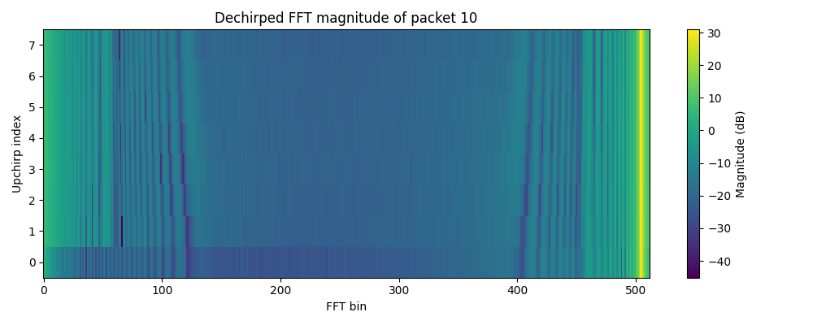
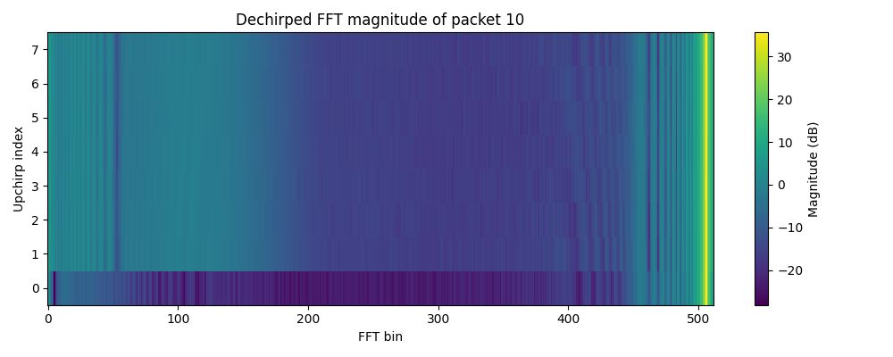

## 中文汇报版

这两天我主要重新做了 LoRa preamble 的提取部分。之前我已经有一版提取代码，但是后来我发现它可能存在对齐不够可靠的问题。因此我重新写了一版代码，目标是更稳定地从接收信号中提取出连续的 8 个 upchirp，并且通过实验结果验证它们确实是对齐正确的。

首先，我根据当前实验参数重新生成了本地 LoRa upchirp 和 downchirp。实验中使用的参数是 SF = 7，带宽 125 kHz，采样率 500 kS/s。因此，一个 LoRa upchirp 对应：

2^SF × Fs / BW = 128 × 4 = 512 complex IQ samples

所以，8 个连续 upchirp 对应：

8 × 512 = 4096 complex IQ samples

接下来，我先做了单窗口检测。对于一个 512 点窗口，我将接收到的 IQ 信号乘以本地 downchirp，也就是进行 dechirp。理论上，如果这个窗口中确实包含一个 LoRa upchirp，那么 dechirp 之后的信号会接近一个单频信号。因此，对它做 FFT 后，频域中应该出现一个明显的峰值。

为了判断一个窗口是否像 LoRa upchirp，我使用了 peak-to-average power ratio 作为检测指标。也就是说，我比较 FFT 最大峰值功率和平均功率。如果这个比值很高，说明频域中存在一个明显的主频率成分，这个窗口很可能包含 LoRa upchirp；如果这个比值较低，说明能量比较分散，更可能是噪声或非 chirp 区域。

然后，我将这个单窗口检测扩展为滑动窗口检测。窗口长度为 512 samples，每次滑动 32 samples。也就是说，对于一个 chirp 长度，我大约检测 16 次。通过这种方式，我可以在接收信号中找到 peak ratio 较高的位置，也就是可能存在 chirp 的候选位置。

但是在实际检测中，同一个 packet 附近会产生多个连续的高检测值，因此不能把每一个 high window 都当作一个新的 packet。由于发送端大约每 1 秒发送一次 packet，所以我设置了 0.8 秒的最小间隔 来去除重复检测，从而得到 coarse candidate positions。

之后，我对每一个 coarse position 做了 local search。因为 coarse position 只能说明附近存在强 chirp，但不一定正好是 8 个 upchirp 的起点。所以我在 coarse position 附近搜索不同的 candidate start。对于每一个 candidate start，我截取 4096 个 IQ samples，并将其分成 8 段，每段 512 samples。然后对每一个 chirp 分别进行 dechirp 和 FFT，并记录每个 chirp 的 FFT peak bin。

我的判断标准是：如果这 8 段信号确实是同一个 LoRa preamble 中连续的 8 个 upchirp，那么它们经过 dechirp 和 FFT 后，peak bin 应该保持一致。

从实验结果来看，完整采集时间内的多个 packet 都表现出了稳定的结果。具体来说，在 node1_preamble.txt 文件中，可以看到检测到的 packet 时间间隔稳定在大约 1 秒左右，这与发送端设置一致。同时，每个 packet 内部的 8 个 upchirp 的 FFT peak bin 完全一致，例如：

bins = [504 504 504 504 504 504 504 504]
unique_8 = 1
mean_ratio = 26.496 dB

这里，unique_8 = 1 表示 8 个 upchirp 的 peak bin 只有一个唯一值，说明它们的频域特征是一致的。mean_ratio 大约在 24 到 26 dB，说明 dechirp 后的 FFT 主峰明显高于平均能量，检测结果比较可靠。

除了 txt 日志，我还画了 dechirped FFT magnitude heatmap。图中横轴是 FFT bin，纵轴是 8 个 upchirp 的 index，颜色表示 FFT magnitude。可以看到，8 行在相同的 FFT bin 附近都有明显的亮峰。这说明提取出来的 8 段信号经过 dechirp 后都表现为稳定的单频分量，而且峰值位置一致。

因此，txt 日志和 heatmap 图结合起来可以证明：我成功地从接收信号中提取出了 LoRa preamble 中连续、稳定、对齐良好的 8 个 upchirp。

## 法语

Ces deux derniers jours, j’ai principalement retravaillé la partie extraction du préambule LoRa. J’avais déjà une première version du code d’extraction, mais j’ai ensuite remarqué qu’il pouvait y avoir un problème de fiabilité au niveau de l’alignement. J’ai donc réécrit une nouvelle version du code, avec pour objectif d’extraire de manière plus stable 8 upchirps consécutifs à partir du signal reçu, puis de vérifier expérimentalement qu’ils sont bien alignés.

Tout d’abord, j’ai régénéré localement l’upchirp et le downchirp LoRa en fonction des paramètres expérimentaux actuels. Les paramètres utilisés sont : SF = 7, bande passante = 125 kHz, et fréquence d’échantillonnage = 500 kS/s. Ainsi, un upchirp LoRa correspond à :

2^SF × Fs / BW = 128 × 4 = 512 échantillons IQ complexes

Donc, 8 upchirps consécutifs correspondent à :

8 × 512 = 4096 échantillons IQ complexes

Ensuite, j’ai d’abord réalisé une détection sur une seule fenêtre. Pour une fenêtre de 512 échantillons, je multiplie le signal IQ reçu par le downchirp local, c’est-à-dire que j’effectue une opération de dechirp. Théoriquement, si cette fenêtre contient réellement un upchirp LoRa, le signal après dechirp devient proche d’un signal monofréquence. Par conséquent, après une FFT, on doit observer un pic clair dans le domaine fréquentiel.

Pour déterminer si une fenêtre ressemble à un upchirp LoRa, j’ai utilisé le peak-to-average power ratio comme critère de détection. Autrement dit, je compare la puissance du pic maximal de la FFT avec la puissance moyenne. Si ce rapport est élevé, cela signifie qu’il existe une composante fréquentielle dominante, et donc que la fenêtre contient probablement un upchirp LoRa. Si ce rapport est faible, cela signifie que l’énergie est plus dispersée, ce qui correspond plutôt à du bruit ou à une zone ne contenant pas de chirp.

Ensuite, j’ai étendu cette détection sur une seule fenêtre à une détection par fenêtre glissante. La longueur de la fenêtre est de 512 échantillons, et le pas de glissement est de 32 échantillons. Cela signifie que, pour une durée correspondant à un chirp, j’effectue environ 16 tests de détection. Cette méthode permet de trouver dans le signal reçu les positions où le peak ratio est élevé, c’est-à-dire les positions candidates où un chirp pourrait être présent.

Cependant, en pratique, autour d’un même packet, plusieurs fenêtres consécutives peuvent donner une valeur de détection élevée. Il ne faut donc pas considérer chaque fenêtre avec un score élevé comme un nouveau packet. Comme l’émetteur envoie environ un packet toutes les secondes, j’ai fixé un intervalle minimal de 0,8 seconde afin de supprimer les détections répétées et d’obtenir des coarse candidate positions.

Ensuite, j’ai effectué une recherche locale autour de chaque coarse position. En effet, une coarse position indique seulement qu’il y a probablement un chirp fort dans cette zone, mais ce n’est pas forcément le vrai début des 8 upchirps. J’ai donc testé différents candidate starts autour de cette position. Pour chaque candidate start, j’extrais 4096 échantillons IQ, puis je les divise en 8 segments de 512 échantillons. Ensuite, pour chaque chirp, j’effectue le dechirp et la FFT, puis j’enregistre le peak bin de chaque chirp.

Mon critère de validation est le suivant : si ces 8 segments correspondent réellement à 8 upchirps consécutifs du même préambule LoRa, alors après dechirp et FFT, leurs peak bins doivent rester identiques.

D’après les résultats expérimentaux, plusieurs packets sur toute la durée d’acquisition montrent un comportement stable. Plus précisément, dans le fichier node1_preamble.txt, on peut observer que l’intervalle entre les packets détectés est stable, autour de 1 seconde, ce qui correspond au réglage de l’émetteur. En même temps, à l’intérieur de chaque packet, les 8 upchirps ont exactement le même FFT peak bin. Par exemple :

bins = [504 504 504 504 504 504 504 504]
unique_8 = 1
mean_ratio = 26.496 dB

Ici, unique_8 = 1 signifie que les 8 upchirps n’ont qu’une seule valeur unique de peak bin, ce qui montre que leurs caractéristiques fréquentielles sont cohérentes. Le mean_ratio, qui est environ entre 24 et 26 dB, montre que le pic principal après dechirp est nettement supérieur à l’énergie moyenne. Cela indique que la détection est fiable.

En plus du fichier txt, j’ai également tracé une heatmap de la magnitude FFT après dechirp. Dans cette figure, l’axe horizontal représente les FFT bins, l’axe vertical représente l’indice des 8 upchirps, et la couleur représente la magnitude FFT. On peut voir que les 8 lignes présentent un pic clair au même niveau de FFT bin. Cela montre que les 8 segments extraits se comportent tous comme des composantes monofréquences stables après dechirp, et que leurs positions de pic sont cohérentes.

Ainsi, en combinant le fichier txt et la heatmap, on peut démontrer que j’ai réussi à extraire depuis le signal reçu 8 upchirps consécutifs, stables et correctement alignés du préambule LoRa.

