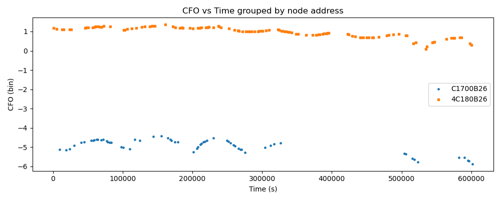
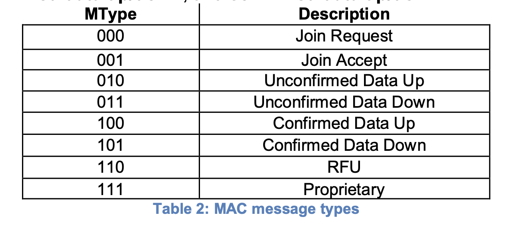

## 中文
我对学校环境中的 LoRaWAN 信号进行了为期约一周的被动监听。在这个实验中，我没有主动发送自己的数据帧，而是只使用 USRP B200 作为接收端，对环境中已有的 LoRa/LoRaWAN 信号进行采集。接收参数为：频率 868.1 MHz，SF7，带宽 BW = 125 kHz。一共采集了727个帧，成功接吗payload只有227个。118个4c，61个c1.48个其他无规律的帧。

在数据处理过程中，我首先根据 LoRa PHY 层的 header checksum 过滤掉明显错误的帧，然后只保留能够成功解析出 payload 的帧。之后，我进一步分析 LoRaWAN PHYPayload 中的 MHDR 字段，主要保留 0x40 类型的上行数据帧，也就是 Unconfirmed Data Up。

对于这些帧，我从 PHYPayload 中提取 DevAddr。由于 LoRaWAN 中 DevAddr 采用 little-endian 小端序存储，所以需要将 MHDR 后面的 4 个字节反序，得到实际显示的 DevAddr。

在这一周采集到的数据中，有两个 DevAddr 反复出现得比较明显：

260B70C1  
260B184C

例如：

40 C1 70 0B 26 ... → DevAddr = 260B70C1  
40 4C 18 0B 26 ... → DevAddr = 260B184C

这说明在当前监听条件下，也就是 868.1 MHz、SF7、BW = 125 kHz，我至少观察到了两个活跃的 LoRaWAN 设备会话。不过，这个结果不能直接代表学校中全部 LoRaWAN 节点的数量，因为本次监听只覆盖了一个频点和一个 SF，而且 DevAddr 也可能在设备重新入网后发生变化。

## 法语 
J’ai réalisé une écoute passive des signaux LoRaWAN présents dans l’environnement de l’école pendant environ une semaine. Dans cette expérience, je n’ai pas émis mes propres trames : j’ai uniquement utilisé l’USRP B200 comme récepteur afin de capturer les signaux LoRa/LoRaWAN déjà présents dans l’environnement. Les paramètres de réception étaient les suivants : fréquence = 868,1 MHz, SF7 et BW = 125 kHz.

Au total, 727 trames ont été détectées. Parmi elles, 227 trames ont pu être décodées avec un payload exploitable. Dans ces 227 trames, 118 correspondent principalement au DevAddr contenant 4C, 61 correspondent au DevAddr contenant C1, et 48 autres trames semblent plus irrégulières ou ne présentent pas de motif clairement répétitif.

Lors du traitement des données, j’ai d’abord utilisé le checksum de l’en-tête LoRa PHY pour filtrer les trames manifestement incorrectes. Ensuite, j’ai conservé les trames pour lesquelles le payload a pu être décodé avec succès. J’ai ensuite analysé le champ MHDR du PHYPayload LoRaWAN, en gardant principalement les trames de type 0x40, qui correspondent à des trames Unconfirmed Data Up.

Pour ces trames, j’ai extrait le DevAddr à partir du PHYPayload. Comme le DevAddr est stocké en little-endian dans LoRaWAN, les quatre octets situés après le MHDR doivent être inversés afin d’obtenir l’adresse affichée.

Dans les données collectées pendant cette semaine, deux DevAddr apparaissent de manière répétée et clairement identifiable :

260B70C1  
260B184C

Par exemple :

40 C1 70 0B 26 ... → DevAddr = 260B70C1  
40 4C 18 0B 26 ... → DevAddr = 260B184C

Cela indique que, dans les conditions d’écoute actuelles, c’est-à-dire à 868,1 MHz, avec SF7 et BW = 125 kHz, j’ai observé au moins deux sessions LoRaWAN actives. Cependant, ce résultat ne représente pas nécessairement le nombre total de nœuds LoRaWAN présents dans l’école, car l’écoute a été limitée à un seul canal et à un seul SF. De plus, le DevAddr peut changer après une nouvelle procédure de join.